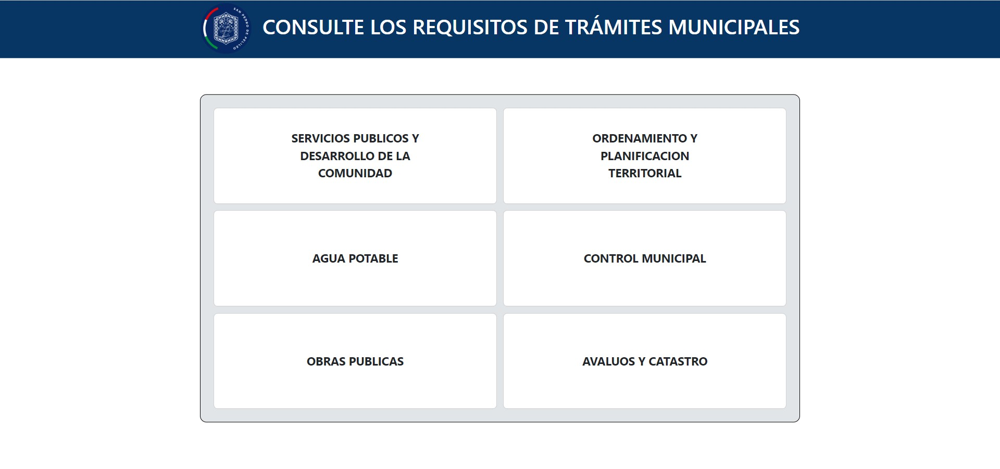
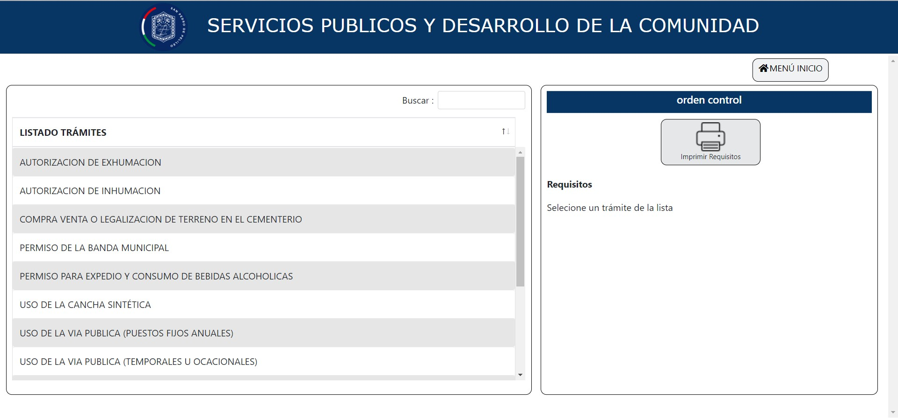

# Sistema para consulta de tramites

Sistema que permite a los usuarios consultar requerimientos necesarios para un tramite, para este caso dentro del Municipio de Pelileo.

## Tecnologías utilizadas

- HTML5
- CSS3
- PHP

## Características

- Diseño moderno y receptivo.
- Secciones claras para mostrar información relevante.
- Listado de todos los item existenten a un nombre en especifico
- Imprimi un comprovante de los inmuebles

## Instalación y ejecución
Por el momento no se encuentra en host, pero se lo puede ejecutar de forma local con un servidor local para su visualización
- Pasos:
1. Clona o descarga este repositorio en tu máquina local.
2. Abre el proyecto en tu editor texto preferido .
3. Coloca el proyecto en tu servidor local.
4. Ejecuta la ruta de tu proyecto en tu navegador de preferencia `localhost/ProyectoEjemplo`

## Personalización

Si deseas personalizar este sitio web para tu propio uso debes tener conocimiento en html5, css3 y php, sigue estos pasos:

1. Modifica los archivo `.html y .css` segun tu diseño; ademas `.php` para conexion a tu BD y servicios.
2. Guarda cambios y puedes ejecutarlo y ver los resultados

## Contribución

Si deseas contribuir a este proyecto, sigue estos pasos:

1. Haz un fork de este repositorio.
2. Crea una rama con un nombre descriptivo: `git checkout -b nombre-de-la-rama`.
3. Realiza tus cambios y guarda los archivos modificados.
4. Haz commit de tus cambios: `git commit -m 'Descripción de los cambios'`.
5. Envía tus cambios al repositorio remoto: `git push origin nombre-de-la-rama`.
6. Abre una solicitud de extracción en GitHub y describe tus cambios en detalle.

## Créditos

- Autor: Paulo Martinez
- Iconos: [Pagina Web]([https://fontawesome.com](http://servicios.pelileo.gob.ec/tramites/index.php))
- Iconos: [Font Awesome](https://fontawesome.com)

